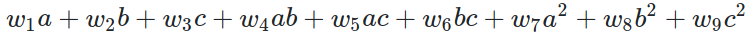

<!-- PROJECT LOGO -->
 

  <h3 align="center">AI self-driving car using a genetic algorithm</h3>

  

    Problem Solving Challenges :: Search in Complex Environments :: Fundamentals of AI 
     
  

<!-- TABLE OF CONTENTS -->

  
<h2 style="display: inline-block">Table of Contents</h2>

  <ol>
    <li><a href="#about">About</a></li>
    <li><a href="#testing">Testing</a></li>
    <li><a href="#setup">Setup</a></li>
    <li><a href="#simulation">Simulation</a></li>
    <li><a href="#license">License</a></li>
    <li><a href="#contact">Contact</a></li>
  </ol>

<!-- ABOUT THE PROJECT -->

## About

|        Population learning (firsts GENs)         |          Cars driving by itselfs (GEN 173)           |
| :----------------------------------------------: | :--------------------------------------------------: |
|  |  |

  
**Motivation**: A typical search algorithm for complex environments is the use of Evolutionary Algorithms. The goal for this challenge is to create a game-like scenario (you can use Unity or any other GUI tool where you can control images and collisions) with a sinuous road. The evolutionary algorithm will control a car that needs to steer in the road, accordingly with its sensors. The agent might rotate left or right, by an amount of x degrees. This value is computed accordingly with the distance of the obstacles for each whisker (sensors), and a weight. The chromosome is comprised of the weights that need to be applied to each input, in order to compute the optimum rotation. Note that the function might not be linear. If you consider a, b and c to be the distances of the different whiskers, you may define a function like (**see image below**). You may attempt higher order polynomials. The fitness function is the maximum amount of time (or distance) that agent lives.

  

**Implementation**: Firstly there's a need to develop the game to simulate the evolution of the genetic algorithm in the 'complex' environment. pygame was used to create the game and the game is composed of four tracks, some cars with different colors and each car has three sensors that cover up to 90 degrees in the front of the car. The PIDCar has about 4 sensors that cover up to 180 degrees and the UserCar does not have sensors since it is controlled by the user. The car controlled by the Agent is eliminated whenever it hits the edge of the track, or whenever the 'CleanerLine' catches it.

The Agent controls the car based on a value that is applied to the car's rotation angle and this value is calculated according to the function we saw above where the inputs will be the distance of the sensors at the moment and the weights will be the gene values of the Agent's current chromosome. The returned value will be normalized to range from -180 to 180 to be then applied to the car's angle.

With that being said said, it is now necessary to implement the genetic algorithm. This is based on Agents with chromosomes of 9 genes and each generation is composed of a population of 100 agents by default. Each gene is composed of a value from -1 to 1 that is initially assigned randomly and represents the weight that the agent should apply for each input in the steering function above. As with any genetic algorithm, the algorithm has to somehow evolve from generation to generation. This process is divided into 3 steps + 1 bonus that was added to improve the evolution of the algorithm.

**1. Selection**: **1. Selection**: First a selection of the best 15~40% agents of the current generation is made. To find out which ones are the best, all agents are sorted according to fitness. The fitness is calculated according to the distance traveled by the agent's car and each time the car crosses the finish line the agent's fitness is increase by 1000 points.

**2. Cross Over**: Crossover is the process of crossing the two best agents chromosome of the current generation to create a new children. How the two parents cross over is randomly choosen. This is done until there are again a total of 100 agents in the current generation.

**3. Mutation**: For each new Child added to the current generation a mutation is done to it. The mutation is done randomly, i.e. there is a random gene of the new child that will be replaced by a new random value between -1 and 1.

**4. Random Agents**: This process was implemented in order to avoid overfitting. Because many times during the evolution the best agent in terms of fitness was not always the best, this is because it could make it through easy turns but once it tried to make a tighter turn, it couldn't and ended up hitting the edge of the track. So in order not to completely discard the best agents, this process was assigned to only 10% of the new children created.

**_Tested with_** with four different tracks [Easy, Medium, Medium-Hard and Hard]

**_Built With_** Pygame (Python framework for games)

<!-- TESTING -->

## Testing

**Avoiding spinning cars**: Some of the cars started to turn around and race in the opposite direction or spinning by itselfs after a few generations and our fitness function consider these cars as the best ones because the function returns the distance traveled for each car. To avoid this mistake it was implemented in the game a CAR controlled by a PID controller with the set point of the controller being always the middle of the track. Was then attached to this car a 'CleanerLine' that will crash spinning cars, cars racing in the opposite direction and even slow cars whenever a car gets in contact with the line.

|              PIDCar cleaning slow cars               |               PIDCar vs Self-driving Agent               |
| :--------------------------------------------------: | :------------------------------------------------------: |
|  |  |

<!-- SETUP -->

## Setup

     install Requirements with:
        $ pip install -r requirements.txt

<!-- SIMULATION -->

## Simulation

    usage: main.py [-h] [-t TRACK] [--user-test] [--agent-test] [--show-cleaner]
               [--show-simulation] [-p POPULATION] [-fps FPS] [-gif]

    optional arguments:
      -h, --help            show this help message and exit
      -t TRACK, --track TRACK
                            racing track to be used on the simulation. {Default:
                            None(Random track)}
      --user-test           spawn car that can be controlled by user. {Default:
                            False}
      --agent-test          test the simulation with only the best car. {Default:
                            False}
      --show-cleaner        show the car used to draw the Cleaning line. {Default:
                            False}
      --show-simulation     show the population evolving in a simulation.
                            {Default: True}
      -p POPULATION, --population POPULATION
                            how many cars for each generation. {Default: 100}
      -fps FPS              frames per second. {Default: 30}
      -gif, --export-gif    export gif with agent driving in four tracks + bonus.
                            {Default: False}

<!-- LICENSE -->

## License

Distributed under the MIT License. See `LICENSE` for more information.

<!-- CONTACT -->

## Contact

Fábio Oliveira - [LinkedIn](https://www.linkedin.com/in/fabioo29/) - fabiodiogo29@gmail.com

Project Link: [https://github.com/fabioo29/ai-self-driving-car](https://github.com/fabioo29/ai-self-driving-car)  
Project built as a Msc. Applied Artificial Intelligence Student.
